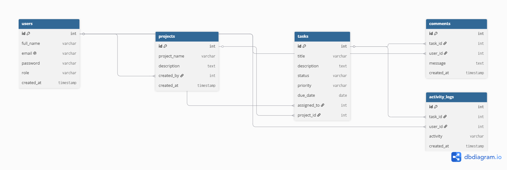
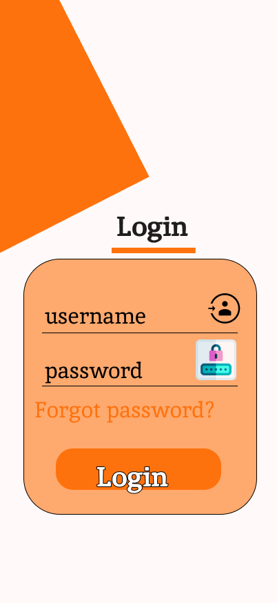
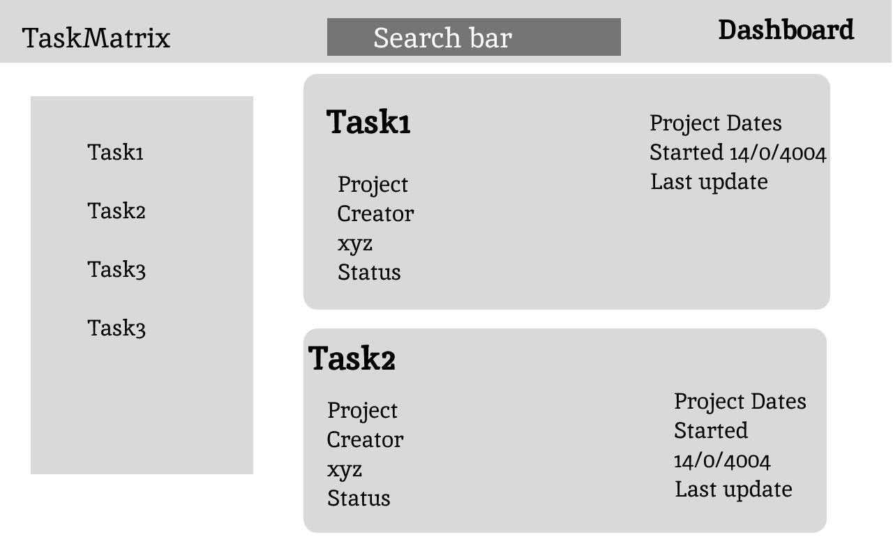

# 🚀 TaskMatrix

> **Enterprise Agile Project Management Platform**

TaskMatrix is a commercial-grade Agile Project Management application designed for software development teams to plan, organize, assign, and track work efficiently. The platform enables collaboration through projects, tasks, Kanban boards, comments, role-based access control, and activity tracking.

This repository contains the **Architecture Blueprint (Sprint 13)** for the Capstone Project. During this sprint, the focus is on product planning, UI/UX design, and system architecture rather than application development.

---

# 📑 Table of Contents

* Project Overview
* Problem Statement
* Proposed Solution
* Designated Track
* Project Objectives
* Target Users
* Core Features
* Technology Stack
* User Roles
* Functional Requirements
* Non-Functional Requirements
* Planned Database Collections
* Planned REST API
* Proposed Folder Structure
* UI/UX Wireframes
* Database Architecture
* AI Prompt Documentation
* Future Enhancements
* Author

---

# 📌 Project Overview

Managing software projects using spreadsheets or scattered communication tools often results in poor visibility, missed deadlines, and inefficient collaboration.

TaskMatrix is designed as a centralized project management platform where teams can create projects, assign tasks, monitor progress through a Kanban board, and collaborate efficiently in real time.

The application follows Agile software development principles and is planned as a scalable MERN Stack application.

---

# ❗ Problem Statement

Many small and medium development teams struggle with:

* Tracking project progress
* Managing task assignments
* Meeting deadlines
* Maintaining communication
* Monitoring team productivity

Without a centralized management system, collaboration becomes inefficient.

---

# 💡 Proposed Solution

TaskMatrix provides a centralized workspace where users can:

* Create and manage projects
* Create, assign, update, and track tasks
* Organize work using a Kanban board
* Monitor deadlines and priorities
* Collaborate through comments
* View project activity history
* Manage users based on roles

---

# 🎯 Designated Track

**Full Stack**

---

# 🎯 Project Objectives

* Build an enterprise-grade Agile Project Management application.
* Practice scalable MERN Stack architecture.
* Implement secure role-based authentication.
* Improve collaboration among development teams.
* Follow Agile software engineering practices.

---

# 👥 Target Users

* Software Development Teams
* Project Managers
* Team Leads
* Developers
* Startup Organizations

---

# ⭐ Core Features

## P0 (Must Have)

* User Registration & Login
* JWT Authentication
* Role-Based Access Control
* Dashboard
* Project Management
* Task CRUD
* Kanban Board
* Task Assignment
* Due Dates
* Priority Labels

## P1 (Important)

* Task Comments
* Activity Feed
* Search & Filters
* User Profile
* Project Statistics

## P2 (Future Scope)

* Email Notifications
* Calendar View
* AI Task Suggestions
* File Attachments
* Team Analytics

---

# 🛠 Technology Stack

## Frontend

* React (Vite)
* Tailwind CSS
* Shadcn UI
* React Router
* Axios

## Backend

* Node.js
* Express.js

## Database

* MongoDB Atlas
* Mongoose

## Authentication

* JWT
* bcrypt

## State Management

* Context API
* Redux Toolkit

## Deployment

* Frontend: Vercel
* Backend: Render
* Database: MongoDB Atlas

---

# 👤 User Roles

## Admin

* Manage all users
* Manage all projects
* View reports
* Remove projects
* Assign managers

## Project Manager

* Create projects
* Assign tasks
* Update project status
* Manage team members

## Team Member

* View assigned tasks
* Update task status
* Add comments
* Track deadlines

---

# 📋 Functional Requirements

* User authentication
* Authorization using roles
* Project CRUD operations
* Task CRUD operations
* Kanban workflow
* Activity logging
* Comment system
* Dashboard analytics

---

# ⚡ Non-Functional Requirements

* Responsive design
* Secure authentication
* Scalable architecture
* RESTful API design
* Clean folder structure
* Maintainable codebase
* Mobile-friendly UI

---

# 🗄 Planned Database Collections

| Collection   | Purpose                          |
| ------------ | -------------------------------- |
| Users        | Store user information and roles |
| Projects     | Store project details            |
| Tasks        | Store project tasks              |
| Comments     | Store task discussions           |
| ActivityLogs | Store user activity history      |



---

# 🔌 Planned REST API

## Authentication

POST /api/auth/register

POST /api/auth/login

---

## Projects

GET /api/projects

POST /api/projects

PUT /api/projects/:id

DELETE /api/projects/:id

---

## Tasks

GET /api/tasks

POST /api/tasks

PUT /api/tasks/:id

DELETE /api/tasks/:id

---

## Comments

GET /api/comments/:taskId

POST /api/comments

---

# 📁 Proposed Folder Structure

```text
frontend/
backend/

docs/
README.md
PROMPTS.md
```
---

## 🎨 UI/UX Wireframes

The UI/UX wireframes for TaskMatrix were designed in Figma before implementation. The design focuses on a clean, responsive, and modern project management interface.

### 🔗 Figma Design

> **Figma Link:**
https://www.figma.com/design/grnlwBQ6QqTrbq4x62XUiz/TaskMatrix---Capstone-UI?node-id=0-1&t=xNehmF1sy9m1LoU6-1

https://www.figma.com/design/grnlwBQ6QqTrbq4x62XUiz/TaskMatrix---Capstone-UI?node-id=82-26&t=xNehmF1sy9m1LoU6-1

https://www.figma.com/design/grnlwBQ6QqTrbq4x62XUiz/TaskMatrix---Capstone-UI?node-id=85-3&t=xNehmF1sy9m1LoU6-1

---

### 📱 Login Screen



---

### 📋 Dashboard Screen


---

### 📄 Project Detail Screen



---

---

# 🤖 AI Prompt Documentation

All AI planning and architectural prompts used during Sprint 13 are documented in **PROMPTS.md** as required by the Capstone submission guidelines.

---

# 🚀 Future Enhancements

* Real-time collaboration using Socket.io
* Calendar integration
* Time tracking
* File uploads
* AI-powered task prioritization
* Performance analytics
* Email reminders

---

# 👨‍💻 Author

**Aryan**

Capstone Project – Sprint 13

Enterprise Full Stack Development Program

