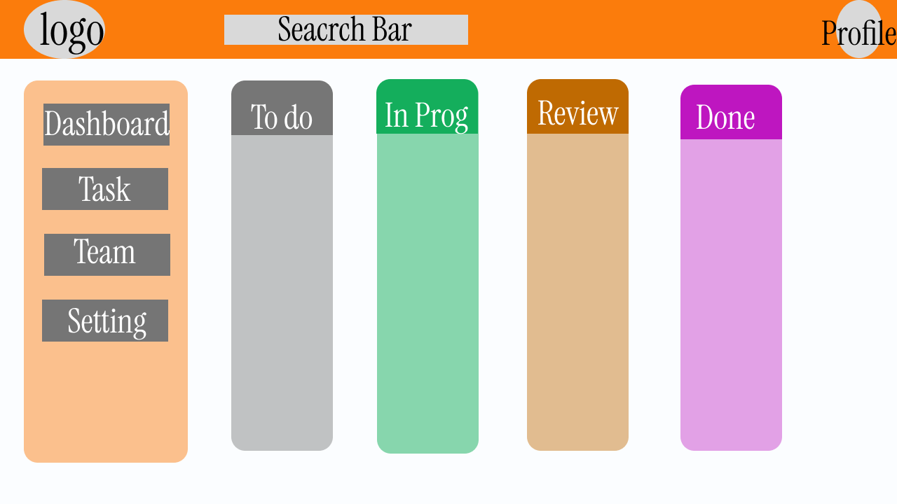

# 🚀 TaskMatrix

> **Enterprise Agile Project Management Platform**

TaskMatrix is a Full Stack Agile Project Management application inspired by Jira and Asana. It enables software development teams to manage projects, assign tasks, collaborate efficiently, and monitor project progress through a secure authentication system and role-based access control.

The project is being developed as part of an Enterprise Full Stack Development Capstone using the MERN Stack and Agile Software Development practices.

---

# 📌 Project Status

| Sprint | Status |
|---------|--------|
| Sprint 13 – Planning & Architecture | ✅ Completed |
| Sprint 14 – Authentication MVP | ✅ Completed |
| Sprint 15 – Project & Task Management | 🔄 In Progress |
| Sprint 16 – AI Integration & UI Enhancement | ⏳ Planned |
| Sprint 17 – Final Deployment & Testing | ⏳ Planned |

---

# 📑 Table of Contents

- Project Overview
- Problem Statement
- Proposed Solution
- Designated Track
- Technology Stack
- Sprint Progress
- MVP Features
- User Roles
- Functional Requirements
- Authentication Flow
- Planned Database Collections
- REST API Endpoints
- Folder Structure
- UI/UX Wireframes
- Database Architecture
- Live Deployment
- AI Prompt Documentation
- Future Enhancements
- Author

---

# 📌 Project Overview

Managing software projects through spreadsheets or disconnected communication tools often leads to missed deadlines, poor visibility, and inefficient collaboration.

TaskMatrix provides a centralized workspace where software teams can create projects, assign tasks, collaborate, and track work using Agile project management principles.

---

# ❗ Problem Statement

Development teams commonly face challenges such as:

- Poor task tracking
- Missed deadlines
- Lack of collaboration
- Difficult project monitoring
- Inefficient communication

TaskMatrix solves these issues through a centralized project management platform.

---

# 💡 Proposed Solution

TaskMatrix allows users to:

- Manage projects
- Create and assign tasks
- Organize work using Kanban Boards
- Track priorities and deadlines
- Collaborate through comments
- Monitor activity history
- Secure user authentication

---

# 🎯 Designated Track

**Full Stack Developer**

---

# 🛠 Technology Stack

## Frontend

- React (Vite)
- React Router DOM
- Axios
- CSS3

## Backend

- Node.js
- Express.js

## Database

- MongoDB Atlas
- Mongoose

## Authentication

- JWT (JSON Web Token)
- bcryptjs

## Deployment

- Frontend → Vercel
- Backend → Render
- Database → MongoDB Atlas

---

# 🚀 Sprint Progress

## ✅ Sprint 13

- Product Requirement Document
- Figma Wireframes
- Database Schema
- Project Planning
- System Architecture

## ✅ Sprint 14

- User Registration
- User Login
- Password Hashing
- JWT Authentication
- Protected Dashboard
- MongoDB Integration
- React Authentication Pages
- Express Authentication APIs
- Deployment to Render & Vercel

---

# ⭐ MVP Features (Sprint 14)

### Authentication

- User Registration
- User Login
- Password Hashing using bcryptjs
- JWT Generation
- Protected Dashboard
- Authentication Middleware

### Backend

- REST API using Express
- MongoDB Atlas Integration
- User Model using Mongoose
- Secure Password Encryption

### Frontend

- Login Page
- Registration Page
- Dashboard
- React Router Navigation
- Axios API Integration

---

# 👤 User Roles

## Admin

- Manage Users
- Manage Projects
- View Reports

## Project Manager

- Create Projects
- Assign Tasks
- Manage Team

## Team Member

- View Assigned Tasks
- Update Status
- Add Comments

---

# 📋 Functional Requirements

- User Authentication
- Authorization
- Dashboard
- Project CRUD
- Task CRUD
- Kanban Board
- Activity Tracking
- Comments

---

# 🔐 Authentication Flow

```text
User Registration
        │
        ▼
Password Hashing (bcrypt)
        │
        ▼
MongoDB Atlas
        │
        ▼
User Login
        │
        ▼
JWT Generated
        │
        ▼
Stored in localStorage
        │
        ▼
Protected Dashboard
```

---

# 🗄 Database Collections

| Collection | Purpose |
|------------|---------------------------|
| Users | User Information |
| Projects | Project Details |
| Tasks | Task Management |
| Comments | Task Discussion |
| ActivityLogs | Activity History |

## Database Schema


---

# 🔌 REST API Endpoints

## Authentication

```
POST /api/auth/register
POST /api/auth/login
```

## Projects

```
GET /api/projects
POST /api/projects
PUT /api/projects/:id
DELETE /api/projects/:id
```

## Tasks

```
GET /api/tasks
POST /api/tasks
PUT /api/tasks/:id
DELETE /api/tasks/:id
```

---

# 📁 Folder Structure

```
TaskMatrix
│
├── frontend
│
├── Backend
│
├── docs
│
├── README.md
│
└── Prompts.md
```

---

# 🎨 UI/UX Wireframes

## Figma Design

https://www.figma.com/design/grnlwBQ6QqTrbq4x62XUiz/TaskMatrix---Capstone-UI

---

## Login Screen


---

## Dashboard



---

## Project Details


---

# 🌐 Live Deployment

## Frontend

https://prodesk-capstone-taskmatrix-zeta.vercel.app

## Backend

https://prodesk-capstone-taskmatrix-1-e6io.onrender.com

## GitHub Repository

https://github.com/ARYAN-WEBDEVELOPER/prodesk-capstone-taskmatrix

---

# 🤖 AI Prompt Documentation

All AI planning and development prompts used during Sprint 13 and Sprint 14 are documented in **Prompts.md**.

---

# 🚀 Future Enhancements

- Drag & Drop Kanban Board
- Project CRUD
- Task CRUD
- Comments
- Activity Feed
- File Uploads
- Calendar View
- Email Notifications
- AI Task Suggestions
- Team Analytics
- Role-Based Permissions

---

# 👨‍💻 Author

**Aryan Sharma**

Enterprise Full Stack Development Capstone

**Sprint 14 – Authentication MVP Completed**
